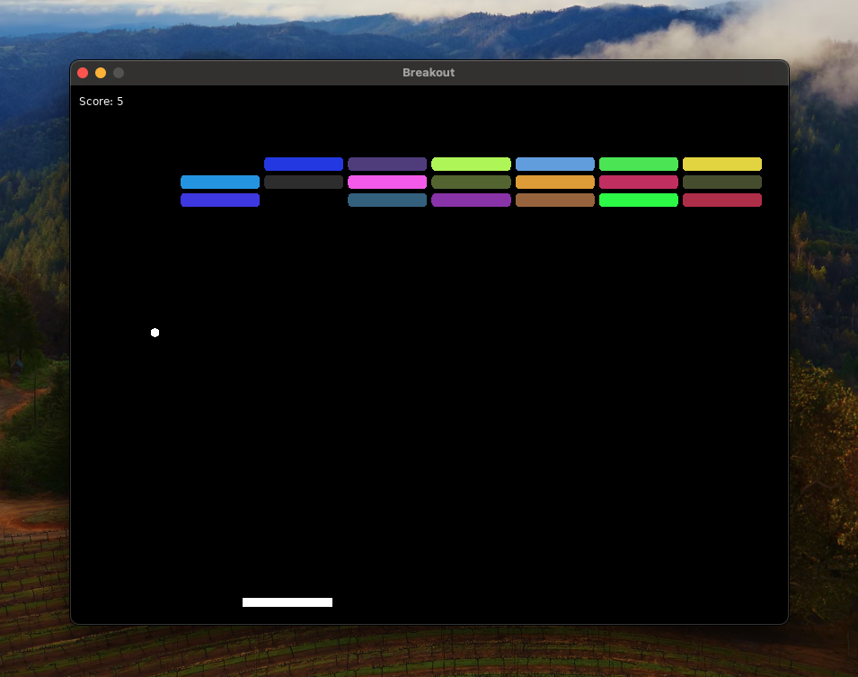

# Atari Breakout clone

A game made on gamedev dungeon over ~1.5 hours in [Love2D engine](https://love2d.org)

**This is a procedural roguelike.**

- By procedural I mean that the bricks have different colors every time
- By roguelike I mean that the game quits if you die

## Assets - credits

- Sounds by Kenney ([link](https://kenney.nl/assets/impact-sounds))
- Jirka image stolen from Garrigue games discord

---

Vojtěch Struhár, 2.9.2024
